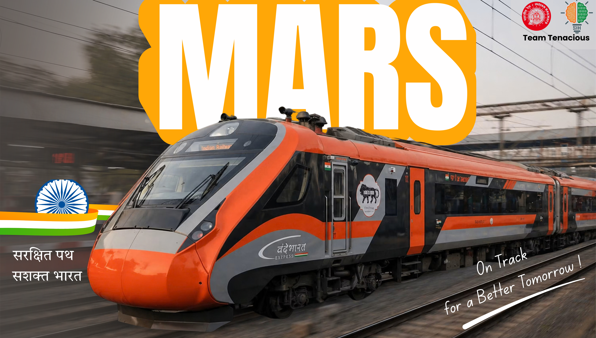

# MARS
### Maintenance Allocation and Resource Scheduling

  

  <strong>AI-Assisted Maintenance Block Planning & Optimization for Indian Railways</strong>

  <a href="https://marsrail.vercel.app">🌐 Live Prototype</a> |
    <a href="https://drive.google.com/drive/folders/1sG9Iyj5gJ_HsyWpSx8zLt35o48CWrWyP?usp=sharing"> Documentation</a> |
  <a href="https://github.com/HMM0007/MARS">GitHub Repository</a>

---

## 🚆 Overview

**MARS (Maintenance Allocation and Resource Scheduling)** is an AI-assisted decision-support system for planning railway infrastructure maintenance blocks across multiple departments while considering train operations, safety constraints, asset criticality, deadlines, resources, and infrastructure availability.

MARS focuses on fixed railway infrastructure across:

- Track & Civil Engineering
- Signalling & Telecommunication (S&T)
- Traction / OHE

It brings maintenance requirements and operational constraints into a common planning workflow, prioritizes work using AI-based risk intelligence, creates strategic and tactical plans, and uses constraint optimization to generate feasible maintenance block schedules.

> **Smart India Hackathon 2026 · Problem Statement 26027**  
> **Ministry of Railways**

---

## 🌐 Live Prototype

### [Open MARS → marsrail.vercel.app](https://marsrail.vercel.app)

The live prototype uses a **React/Vite frontend hosted on Vercel** and a **FastAPI backend hosted on Render**.

---

## 🎯 Problem

Railway maintenance planning requires coordination between departments while infrastructure remains subject to train movements, safety requirements, resource limitations, deadlines, and block availability.

A maintenance **job** is not the same as a maintenance **block**. Multiple compatible jobs may be coordinated into one shared possession window, while incompatible activities must be separated.

Manual or fragmented planning can make it difficult to:

- prioritize large numbers of maintenance jobs consistently;
- coordinate Engineering, S&T and Traction activities;
- account for operational restrictions;
- utilize maintenance windows efficiently;
- manage limited machines and resources;
- respond quickly when conditions change;
- preserve encoded safety constraints during replanning; and
- explain why a job or block was prioritized.

MARS approaches this as a **hybrid AI + optimization problem**.

---

## 💡 Solution Architecture

~~~text
              MAINTENANCE + OPERATIONAL DATA
                           │
                           ▼
                 ┌───────────────────┐
                 │ Integration Layer │
                 └─────────┬─────────┘
                           │
                           ▼
                 ┌───────────────────┐
                 │ AI Risk Intelligence
                 │      XGBoost      │
                 └─────────┬─────────┘
                           │
                           ▼
                    CORS + Risk Clock
                           │
              ┌────────────┴────────────┐
              ▼                         ▼
    MONTHLY STRATEGIC PLAN      WEEKLY TACTICAL PLAN
       4-week horizon              7-day horizon
              │                         │
   Forecasting + grouping       OR-Tools CP-SAT
   + capacity allocation        + hard constraints
              │                         │
              └────────────┬────────────┘
                           ▼
                 Validation & Replanning
                           │
                           ▼
                    Human Approval
                           │
                           ▼
                Approved Maintenance Plan
~~~

---

## 🧠 AI Risk Intelligence

MARS separates **risk estimation** from **schedule optimization**.

### XGBoost — Composite Operational Risk Score

XGBoost estimates a **Composite Operational Risk Score (CORS)** on a 0–100 scale representing the modeled operational risk of not completing a maintenance job within the planning horizon.

Example features include:

- defect severity;
- asset criticality;
- days overdue;
- traffic density;
- asset age;
- contextual/monsoon indicators;
- department; and
- safety-critical flag.

### Risk Clock

Risk can increase when a job is repeatedly deferred. MARS therefore applies a separate dynamic escalation layer:

~~~text
Final Score = min(CORS × (1 + α)^deferral_count, 100)
~~~

The prototype uses a configurable multiplier cap to prevent uncontrolled escalation.

**Important:** deferral increases scheduling priority; it does **not** automatically change the formal defect severity or safety classification of a job.

---

## 📅 Two-Level Planning

| Level | Horizon | Purpose | Main Techniques |
|---|---:|---|---|
| Strategic | 4 weeks | Allocate maintenance demand across weeks/sections | Forecasting, grouping, capacity allocation |
| Tactical | 7 days | Create detailed feasible schedules | XGBoost, Risk Clock, CP-SAT |

**Strategic:** What should be planned, and in which week?

**Tactical:** When and how can it be safely scheduled?

The weekly tactical horizon uses **15-minute planning slots**.

---

## ⚙️ Optimization Engine

MARS uses **Google OR-Tools CP-SAT** to search for feasible schedules under encoded operational and safety constraints.

### Hard constraints

- train movement clearance;
- safety buffers;
- minimum maintenance duration;
- OHE/power isolation requirements;
- physical safety/exclusion constraints;
- job dependencies;
- hard deadlines;
- section/block capacity; and
- resource availability.

### Optimization objectives

- prioritize critical maintenance;
- respect deadlines;
- reduce weighted asset unavailability;
- reduce maintenance downtime;
- reduce unnecessary deferrals;
- consolidate compatible departmental work;
- reduce operational impact; and
- maintain consistency with the strategic plan.

If the model becomes infeasible, MARS surfaces the conflict for planner review instead of silently relaxing a hard constraint.

---

## 🔗 Multi-Department Block Coordination

A **maintenance block** represents the infrastructure possession/closure window, while individual jobs represent the work performed during that possession.

### SINGLE
A possession used by one department.

### CONSOLIDATED
A shared possession containing compatible work from multiple departments.

~~~text
TRACK_1_UP
23:00 ───────────────────────────────── 02:00
       Engineering │ S&T │ Traction
       └──────────── ONE SHARED POSSESSION ────────┘
~~~

Compatible jobs do not necessarily execute simultaneously. They can execute sequentially within the same possession when the encoded safety and resource constraints permit it.

### SHADOW
An associated restriction on an adjacent or related track/infrastructure area considered during planning.

Compatibility considers:

- spatial compatibility;
- temporal compatibility;
- resource availability;
- safety;
- isolation; and
- operational restrictions.

---

## 🔄 Dynamic Replanning

MARS supports replanning when conditions change, including:

- new high-priority or safety-critical maintenance;
- block unavailability;
- train/operational window changes;
- OHE availability changes;
- machine/resource unavailability;
- maintenance overruns;
- increased risk; and
- planner What-If scenarios.

### Progressive Reoptimization

~~~text
Affected area
     ↓
Adjacent sections
     ↓
Wider planning area
     ↓
Remaining week
~~~

Completed and past work is frozen. In-progress work retains its actual progress and remaining duration.

---

## 👤 Human-in-the-Loop

MARS is a **decision-support system**, not an autonomous replacement for the railway planner.

The planner can:

- review generated schedules;
- inspect job priorities;
- move or modify blocks;
- change durations;
- add or remove jobs;
- perform What-If analysis;
- override priorities with an audit reason; and
- approve the final plan.

Manual changes are revalidated against the encoded constraints.

---

## 🔌 Railway System Integration

MARS uses an adapter-based architecture so existing Railway systems can remain the systems of record.

| System | MARS Integration Role |
|---|---|
| **TMS** | Track/Engineering maintenance information |
| **SMMS** | Signalling & Telecommunication maintenance information |
| **TDMS** | Traction/OHE maintenance information |
| **COA** | Operational/train availability information |
| **BDMS** | Block/sanction interface and downstream plan exchange |

The adapter layer converts source-system formats into a common MARS planning model.

> **Prototype note:** the current system uses simulated/synthetic Railway-style data and adapter interfaces. Production deployment would require authorized access to operational Railway systems and approved interfaces.

---

## 📊 Asset Availability

MARS considers asset criticality when evaluating maintenance impact.

The prototype maintains:

- asset criticality at asset level;
- defect severity at job level;
- unavailable time;
- section context; and
- configurable impact factors.

These values can be used to evaluate weighted asset unavailability and compare planning scenarios.

Prototype parameters are configurable and require calibration using operational Railway data before production deployment.

---

## 🗂️ Dataset

The prototype uses a structured Railway-style synthetic dataset containing entities such as:

- Sections
- Assets
- Maintenance Jobs
- Blocks
- Trains
- Train–Section relationships
- Goods/traffic demand information
- Departments
- Resources and planning constraints

Synthetic data is used because the prototype does not have access to operational Railway maintenance databases.

The dataset is designed to preserve realistic relationships between jobs, assets, sections, operational windows, resources, and constraints.

---

## 🧪 Validation & Prototype Evaluation

MARS can be evaluated using the same workload and infrastructure conditions under:

1. a baseline/manual-style planning process; and
2. MARS-assisted planning.

Evaluation metrics include:

- planning time;
- infrastructure downtime;
- asset availability;
- maintenance block requirement;
- constraint violations;
- resource utilization; and
- replanning response.

**Prototype impact values are scenario-based demonstration results, not official Indian Railways performance statistics.**

---

## 🛠️ Technology Stack

### Frontend
- React
- Vite
- Tailwind CSS
- Map-based visualization
- Interactive planning/Gantt interfaces

### Backend
- Python
- FastAPI
- Pydantic
- SQLAlchemy
- Pandas / NumPy

### AI & Optimization
- **XGBoost** — risk scoring
- **Prophet** — demand forecasting
- **Google OR-Tools CP-SAT** — constraint optimization
- **Scikit-learn** — preprocessing/model utilities

### Data
- SQLite for the current prototype
- PostgreSQL-compatible architecture for production-oriented deployment

### Deployment
- **Vercel** — frontend
- **Render** — backend
- **GitHub** — source control and deployment integration

---

## 📁 Repository Structure

~~~text
MARS/
├── backend/
│   ├── app/
│   │   ├── adapters/       # Railway-system integration adapters
│   │   ├── api/            # API routes
│   │   ├── core/           # Planning, optimization and replanning
│   │   └── ...
│   ├── data/
│   ├── scripts/
│   ├── tests/
│   ├── requirements.txt
│   └── .env.example
│
├── frontend/
│   ├── src/
│   │   ├── components/
│   │   ├── pages/
│   │   ├── services/
│   │   └── ...
│   ├── public/
│   ├── package.json
│   ├── vite.config.js
│   └── vercel.json
│
├── data/
│   └── raw/
│
├── render.yaml
└── README.md
~~~

---

## 🚀 Run Locally

### Prerequisites

- Python 3.11+
- Node.js 18+
- npm
- Git

### Clone

~~~bash
git clone https://github.com/HMM0007/MARS.git
cd MARS
~~~

### Backend

~~~bash
cd backend
python -m venv .venv
~~~

Windows:

~~~bash
.venv\Scripts\activate
~~~

Linux/macOS:

~~~bash
source .venv/bin/activate
~~~

Install dependencies:

~~~bash
pip install -r requirements.txt
~~~

Start FastAPI:

~~~bash
uvicorn app.main:app --reload
~~~

Backend:

~~~text
http://127.0.0.1:8000
~~~

Health check:

~~~text
http://127.0.0.1:8000/health
~~~

### Frontend

Open another terminal:

~~~bash
cd frontend
npm install
npm run dev
~~~

Frontend:

~~~text
http://localhost:5173
~~~

For a local frontend, configure:

~~~text
VITE_API_URL=http://127.0.0.1:8000
~~~

---

## 🔐 Configuration

Backend environment variables include:

~~~text
ENV=development
DATABASE_URL=sqlite:///./data/mars.db
CORS_ORIGINS=http://localhost:5173
~~~

Production deployments should use restricted CORS origins, proper authentication/authorization, secure secrets, TLS, and an approved Railway network/integration architecture.

---

## 🧩 Design Principles

**AI-assisted, not AI-only**  
AI supports prioritization and forecasting; optimization handles encoded constraints.

**Feasibility before objectives**  
Hard constraints must be satisfied before a schedule is considered feasible.

**Human-in-the-loop**  
The planner remains responsible for reviewing and approving the final plan.

**Explainability and auditability**  
Priority changes, overrides, replanning and planning decisions should remain traceable.

**Progressive replanning**  
MARS attempts to modify only the affected portion of the schedule before expanding the replanning scope.

**Integration, not replacement**  
MARS is designed as a planning and decision-support layer around existing Railway systems.

---

## ⚠️ Prototype Scope & Limitations

This repository represents a **prototype / demonstration system**.

- Prototype datasets are synthetic.
- AI training labels are synthetic expert-informed labels rather than operational Railway labels.
- Risk Clock parameters are prototype configuration values.
- Impact measurements are scenario-based demonstration results.
- Production integration requires authorized Railway-system interfaces and operational data.
- Production security, identity management and infrastructure controls require deployment within an approved Railway environment.
- Prototype results should not be interpreted as official Railway operational performance statistics.

---

## 🔮 Future Scope

Potential production-oriented extensions include:

- integration with authorized Railway operational systems;
- calibration of risk models using historical maintenance outcomes;
- automated model monitoring and retraining;
- richer resource and machine scheduling;
- advanced disruption/capacity modelling;
- enterprise authentication and RBAC;
- immutable audit logging;
- production PostgreSQL deployment;
- expanded What-If and scenario analysis; and
- pilot validation with real maintenance planning workflows.

---

## 📚 Technical Foundations

MARS builds on established work in:

- railway maintenance planning and scheduling;
- data-driven railway maintenance;
- integrated railway operations and maintenance optimization;
- gradient-boosted decision trees;
- time-series forecasting; and
- constraint programming / CP-SAT optimization.

Research and technical references are maintained in the project's documentation and reference materials.

---

## 👥 Project

**MARS — Maintenance Allocation and Resource Scheduling**

**Smart India Hackathon 2026**  
**Problem Statement:** 26027  
**Ministry:** Ministry of Railways  
**Team:** Team Tenacious

---

## 📜 License

No open-source license is currently specified. Unless a license is added, repository contents should be treated as **all rights reserved** by the project owners.

---

  <strong>MARS</strong> 
  AI-Assisted Railway Maintenance Block Planning & Optimization

